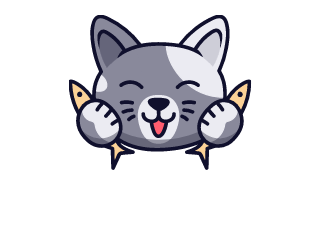

<!-- Project Logo -->
<br />
<p align="center">
  <a href="https://github.com/hblackmer/kitty-game">
    
  </a>
</p>

<!-- GETTING STARTED -->
### Installation

1. Clone the repo
   ```sh
   git clone https://github.com/hblackmer/kitty-game.git
   ```

<!-- ROADMAP -->
## Roadmap

See the [open issues](https://github.com/hblackmer/kitty-game/issues) for a list of proposed features (and known issues).

<!-- CONTRIBUTING -->
## Contributing

Contributions are what make the open source community such an amazing place to be learn, inspire, and create. Any contributions you make are **greatly appreciated**.

1. Fork the Project
2. Create your Feature Branch (`git checkout -b feature/AmazingFeature`)
3. Commit your Changes (`git commit -m 'Add some AmazingFeature'`)
4. Push to the Branch (`git push origin feature/AmazingFeature`)
5. Open a Pull Request

<!-- Project -->
## Project
Project Link: https://github.com/hblackmer/kitty-game
